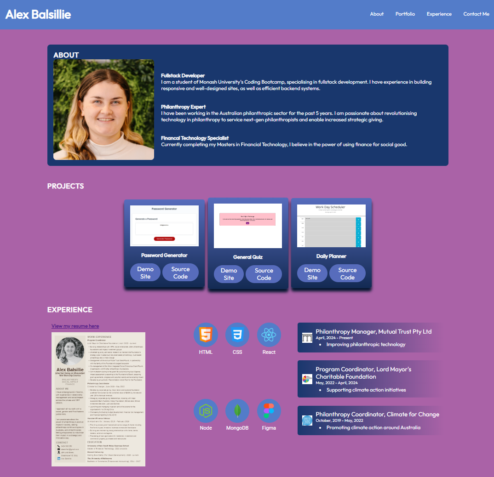

# React Portfolio

## Description
The application displays my professional information, similar to a LinkedIn page, used to attract potential employers and connect with other developers for collaboration.

## Installation
Run an npm install to install all dev dependencies, then npm run start to launch the application.

## Built With
- JavaScript
- Node.js
- React JS
- Vite
- Eslint
- Visual Studio Code
- Deployed using Netlify

## Usage

## License
MIT License
